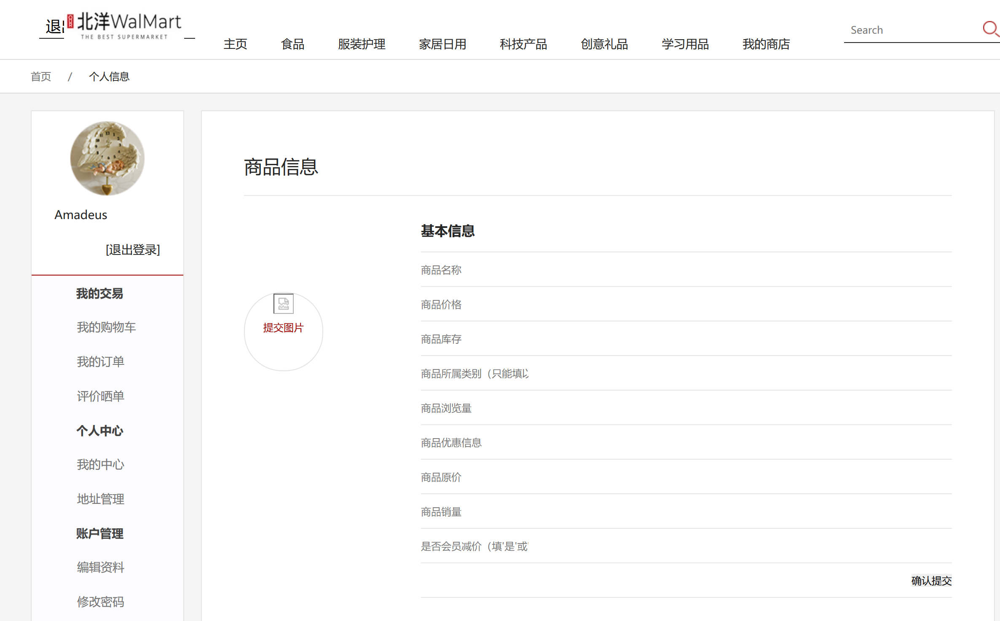
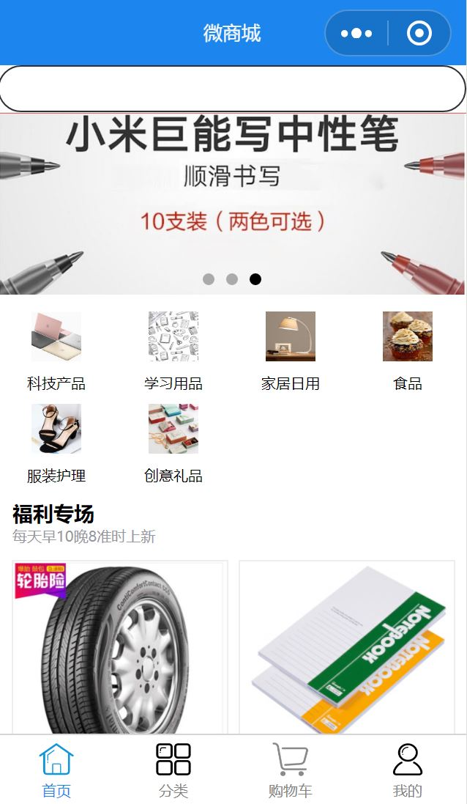
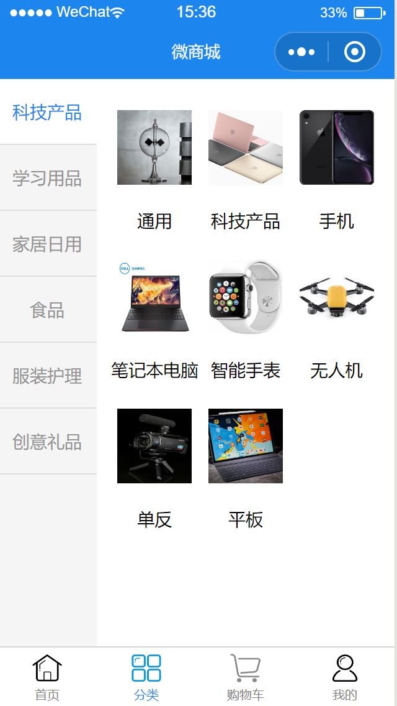
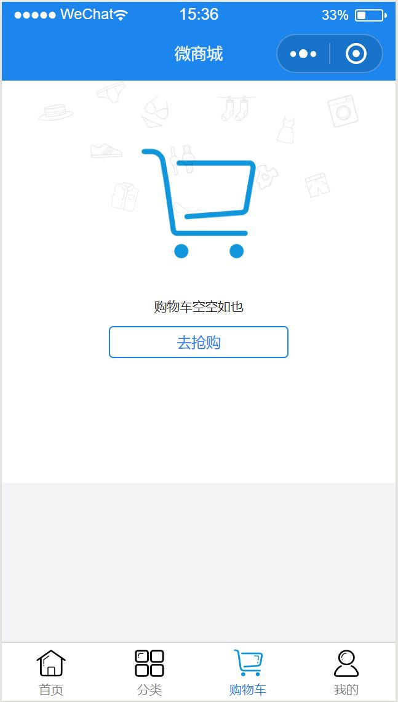
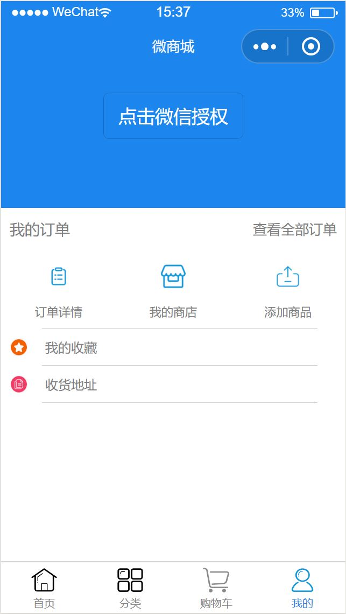
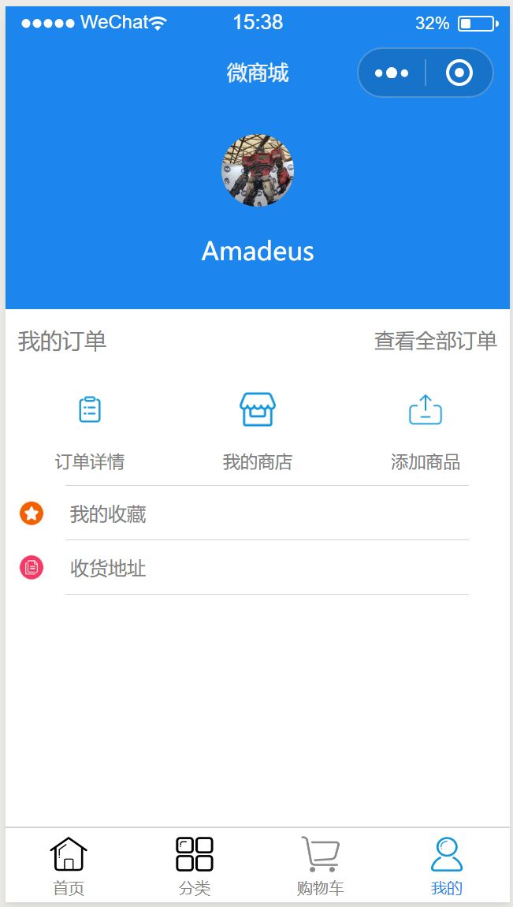

# E_commerce
## 1.Android
目录下是为电商平台适配的安卓平台应用项目源码
项目由Android Studio开发，由于时间关系，App只向下兼容到Andriod 6.0，更低版本不保证能运行。
提供APK下载适用
--------------------------------------------------------------
## 2.Backend目录下为后端源码。目前已经部署在阿里云服务器,可以直接使用访问
主要借助Django REST Framework开发,配置好后也可以搭建自己的后台
API文档中有后端数据库的详细说明以及API使用详细说明，全文长达9000字。
--------------------------------------------------------------
## 3.Forend目录下为前端源码,属于特定的网站http://www.mallproject.cn:8000/login

>首页

>我的
--------------------------------------------------------------
## wx App目录下为微信小程序源码   可以直接打开使用

>首页

>类别

>购物车

>我的（未登录）

>我的(登陆)
--------------------------------------------------------------

<!-- 以下分别为对应的截图
微信小程序端 -->

